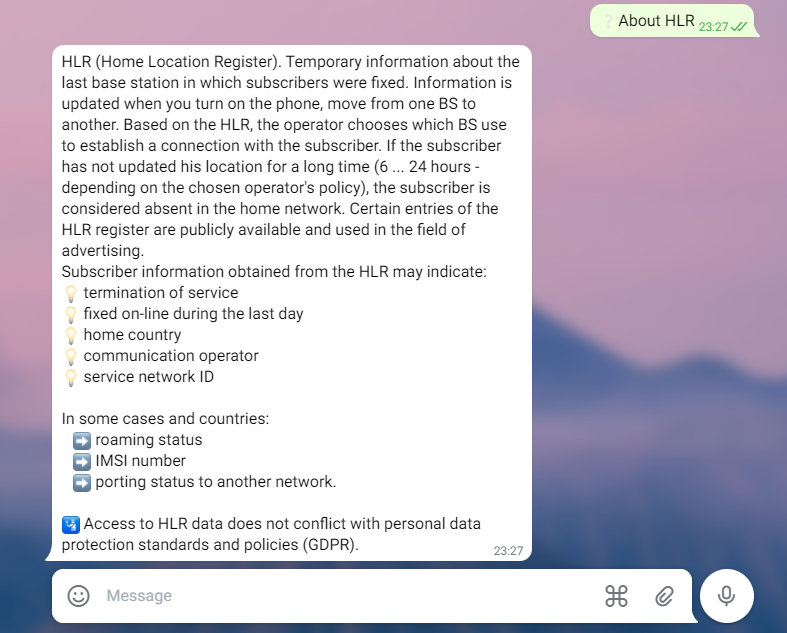
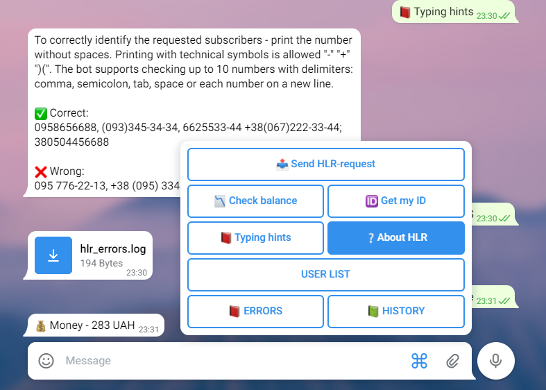
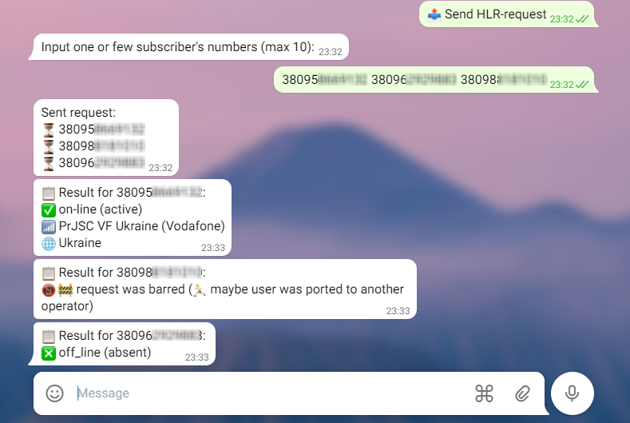
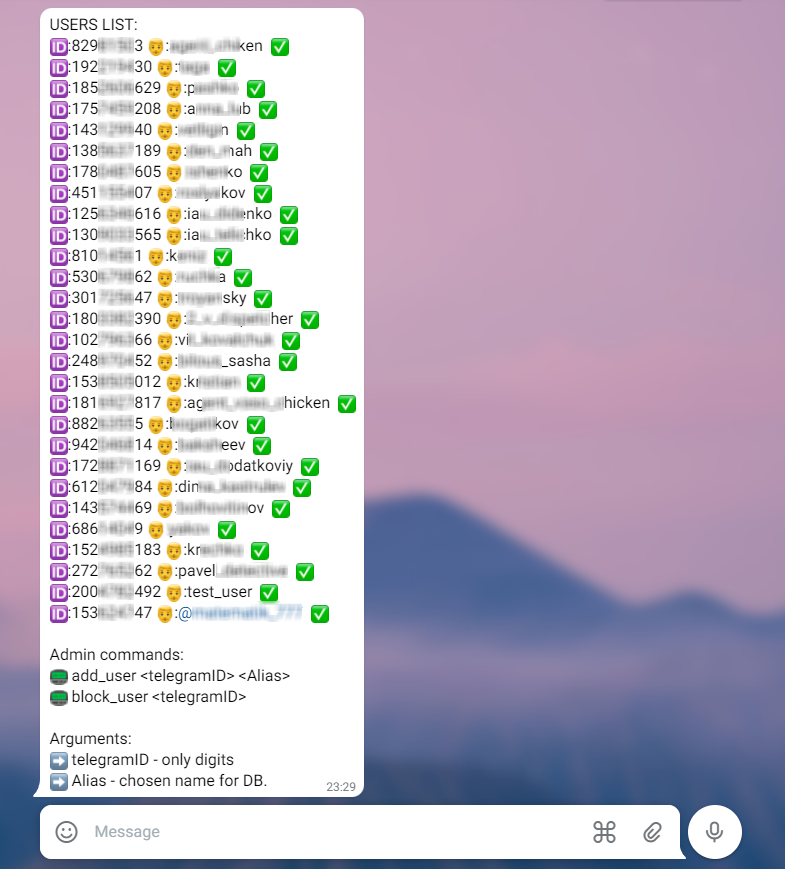
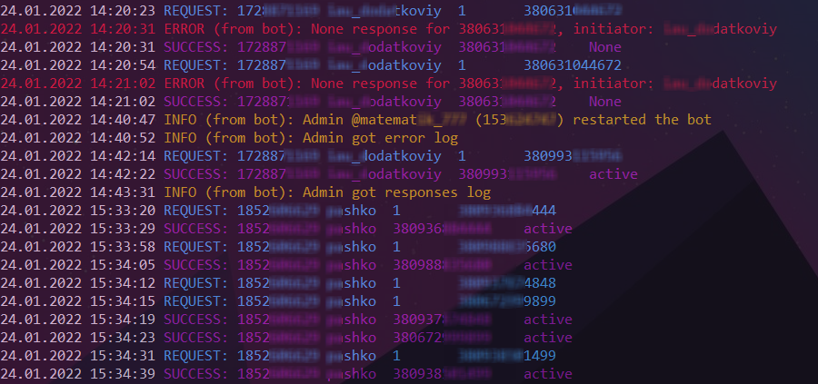

# HLR-lookup TelegramBot with BSG World API

[](https://github.com/OlehOleinikov/hlr_lookup_bot#used-api)
[](https://github.com/OlehOleinikov/hlr_lookup_bot#logging)
[](https://github.com/OlehOleinikov/hlr_lookup_bot#used-api)
[](https://github.com/OlehOleinikov/hlr_lookup_bot#users-access)
[](https://github.com/OlehOleinikov/hlr_lookup_bot#environment-variables)

## App description

HLR-lookup bot. The request is processed by the communication operator without reaching the telephone of the checked subscriber (it is not reflected in the call details and is not shown to the subscriber). Subscriber information obtained from the HLR register may indicate:
- termination of service
- stay in touch during the last day
- home country
- home network ID
- home operator name

In some cases and countries:
- roaming status
- IMSI number
- porting to another network

Access to HLR data does not conflict with personal data protection standards and policies (GDPR). 



## Features

- access filter by Telegram ID
- add/block users from admin acc
- check account balance
- "get-my-ID" button
- logging
- inbox preparer (subscriber number converter)
- multiple subscribers requests



## Used API

- HLR-lookup: API from the provider of related telecommunication services [*BSG.World*](https://bsg.world) (version 0.2.9). 
The current version by [github link](https://github.com/bsgworld/bsg-python)
- Bot: [pyTelegramBotAPI](https://pypi.org/project/pyTelegramBotAPI/) ~= 4.3.1 (don't use *telebot* - it is another lib)



## Build to run

- get [BSG.World](https://app.bsg.world/auth/) and [BotFather](https://telegram.me/BotFather) tokens
- download [BSG.World REST API](https://github.com/bsgworld/bsg-python/tree/master/bsg_restapi)
- prepare ```.env``` file with tokens and administrator information
- if necessary, prepare a database file ```users.sqlite3``` with trusted users list
- verify package installation according to requirements file 

## Environment variables

To securely store sensitive data and settings, some variables are stored in a separate '.env' file and loaded 
into operating system environment variables on the session. ```.env``` file structure:

| Variable |Description |
| :---: | :---: |
| **TOKEN_BOT_HLRLOOKUP** |*BotFather's token* |
| **TOKEN_API_HLRLOOKUP** |*BSG World token* |
| **HLRLOOKUP_ADMIN_CONTACT** |*@name Telegram user link* |
| **HLRLOOKUP_ADMIN_ID** |*Telegram id* |
| **HLRLOOKUP_DB_FILE** |*DB file name* |

## Config file - user defines

| Var | Default | Desc |
| :---: | :---: | :---: |
| **UPDATE_INTERVAL** | 3 | *checking for new messages every n seconds* |
| **UPDATE_TIMEOUT** | 25 | *milliseconds waiting for Telegram server response* |
| **LIST_LIMIT** | 10 | *max subscribers per request* |
| **AWAIT_RESPONSE_TIME** | 7 | *time (sec) from HLR request to API check status* |

## Users access



Single table database (sqlite3 used):
```sql
CREATE TABLE "users" (
	"record"	INTEGER NOT NULL UNIQUE,
	"telegram_id"	TEXT NOT NULL UNIQUE,
	"alias"	TEXT NOT NULL,
	"access_level"	INTEGER NOT NULL DEFAULT 1,
	PRIMARY KEY("record" AUTOINCREMENT)
);
```
Database managment provides by ```Users``` class. Allows methods: 
- ```check_id``` - returns access permission (bool)
- ```get_alias``` - returns user name by id (str)
- ```add_user``` - add new user to DB or give access to blocked user
- ```block_user``` - set zero access level
- ```get_users``` - returns users list (one string with \n sep)

## Logging

For this reason used [```loguru```](https://pypi.org/project/loguru/) python lib.

- **Errors log** - connection crashing, timouts, warnings, etc.
- **Debug log** - all events log (sink)
- **Responses log** - HLR responses (each row by one phone number)
- **Console echo** - events monitoring, service info, color view




